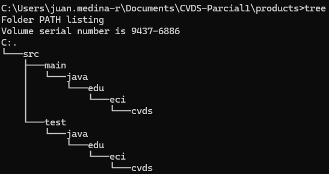
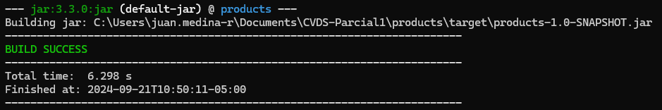
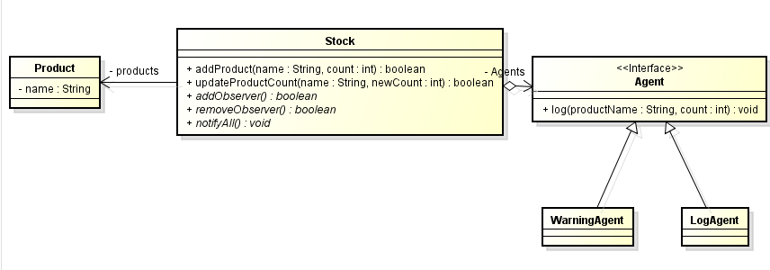

# PARCIAL PRIMER CORTE - SOLID, PATRONES, TDD, SPRING

## PRE-RREQUISITOS
- Java JDK Runtime Environment: 17.x.x
- Apache Maven: 3.9.x
- JUnit: 5.x.x

### Configuración del proyecto Maven
Una vez creado el repositorio en GitHub, se clona localmete y e utiliza el siguiente comando para inicializar el proyecto Maven

```mvn archetype:generate -DgroupId=edu.eci.cvds -DartifactId=products -DarchetypeArtifactId=maven-archetype-quickstart -DinteractiveMode=false```

Para generar como resultado le siguiente árbol de directorios.


También se añaden las dependencias necesarias que serán utilizadas en el proyecto como:
- Java 17.x.x
```
<properties>
    <maven.compiler.target>17</maven.compiler.target>
    <maven.compiler.source>17</maven.compiler.source>
</properties>
```

- JUnit 5.x.x
```
<dependency> 
     <groupId>org.junit.jupiter</groupId> 
     <artifactId>junit-jupiter-api</artifactId> 
     <version>5.8.0</version> 
     <scope>test</scope> 
</dependency>
```

- Jacoco
```
<build>
    <plugins>
      <plugin>
        <groupId>org.jacoco</groupId>
        <artifactId>jacoco-maven-plugin</artifactId>
        <version>0.8.12</version>
        <executions>
          <execution>
            <goals>
              <goal>prepare-agent</goal>
            </goals>
          </execution>
          <execution>
            <id>report</id>
            <phase>test</phase>
            <goals>
              <goal>report</goal>
            </goals>
            <configuration>
              <excludes>
                <exclude>/configurators/</exclude>
              </excludes>
            </configuration>
          </execution>
          <execution>
          <id>jacoco-check</id>
          <goals>
            <goal>check</goal>
          </goals>
          <configuration>
            <rules>
              <rule>
                <element>PACKAGE</element>
                  <limits>
                    <limit>
                      <counter>CLASS</counter>
                      <value>COVEREDRATIO</value>
                      <minimum>0.85</minimum><!--Porcentaje mínimo de cubrimiento para construir el proyecto-->
                    </limit>
                  </limits>
                </rule>
              </rules>
            </configuration>
          </execution>
        </executions>
      </plugin>
    </plugins>
  </build>
```

Probar que la ocnfiguración inicial del proyecto haya sido creada correctamente con los comandos
```
mvn compile
mvn test (Aunque aún no hay pruebas realizadas)
mvn package
```


### Diseño Diagrama de Clases
Para el diseño del proyecto se va a utilizar el patrón de diseño `Observador`, esto nos permite crear una relación entre los cambios que se realicen a Stock y notificar a todos los Agentes involucrados, en este caso a WarningAgent y LogAgent.


También se utilizara la inyección de dependencias mediante Spring para asignar los Agentes que se encargarán de hacer los Log respectivos.


